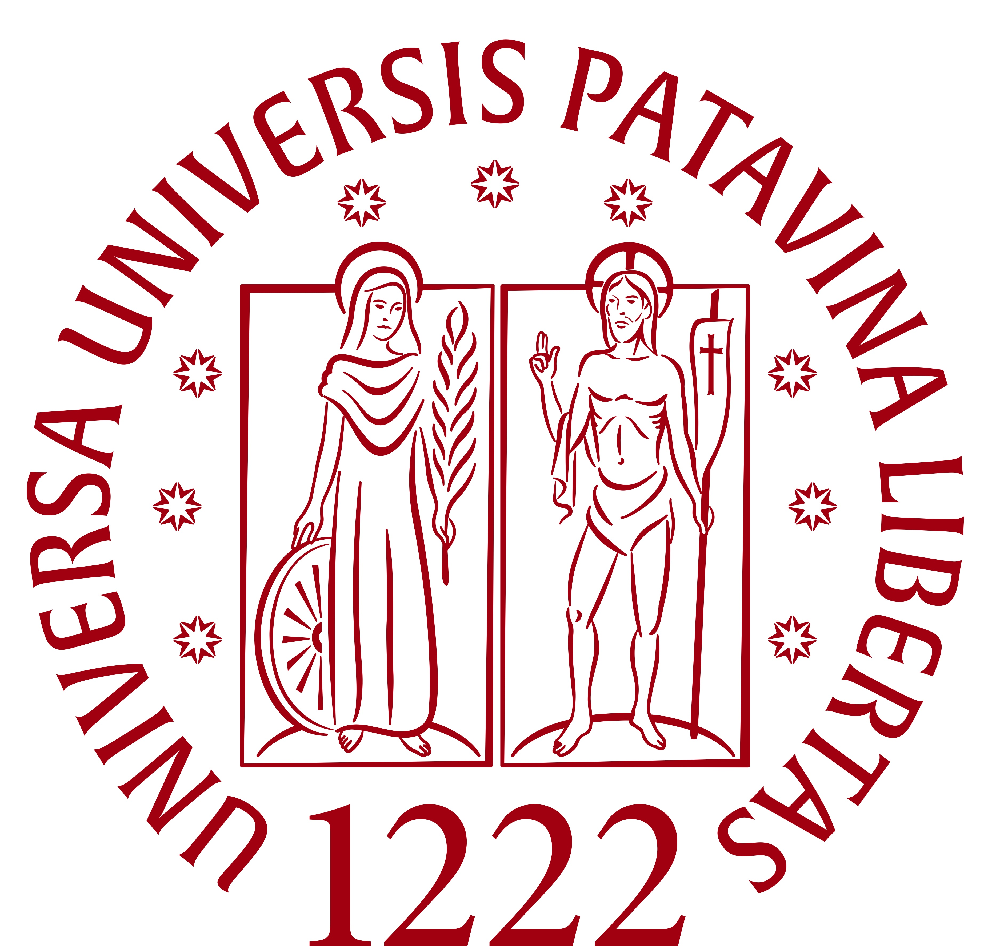

# Tesi di laurea

<p align="center">
  
</p>

**Titolo:** Sviluppo di un prototipo di biglietteria automatizzata conforme alla normativa AdE/SIAE

**Autore:** Edis Hodja

**Relatore:** Prof. Zanella Marco

## Compilazione

Installa [Typst](https://typst.app/) e dalla radice della repo esegui:

```sh
typst compile --root . src/main.typ tesi.pdf
```

Il PDF generato non viene versionato; il template di esempio in `template/` è mantenuto.

## Struttura

- `src/main.typ`: impostazioni, frontespizio, sommario e indice; include i capitoli.
- `src/chapters/`: un file Typst per capitolo, inclusa la bibliografia.
- `img/`: immagini utilizzate dalla tesi.
- `template/`: template PDF di riferimento.
- `.github/workflows/build.yml`: compilazione automatica a ogni push e pull request.

`main` contiene la tesi completa e compilabile. Usa branch brevi per le modifiche trasversali e non un branch distinto per ogni capitolo.
